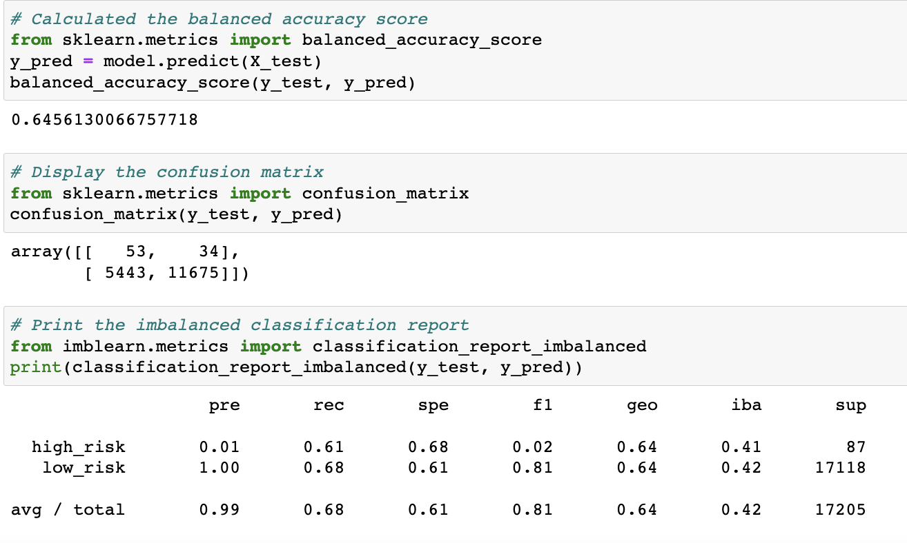
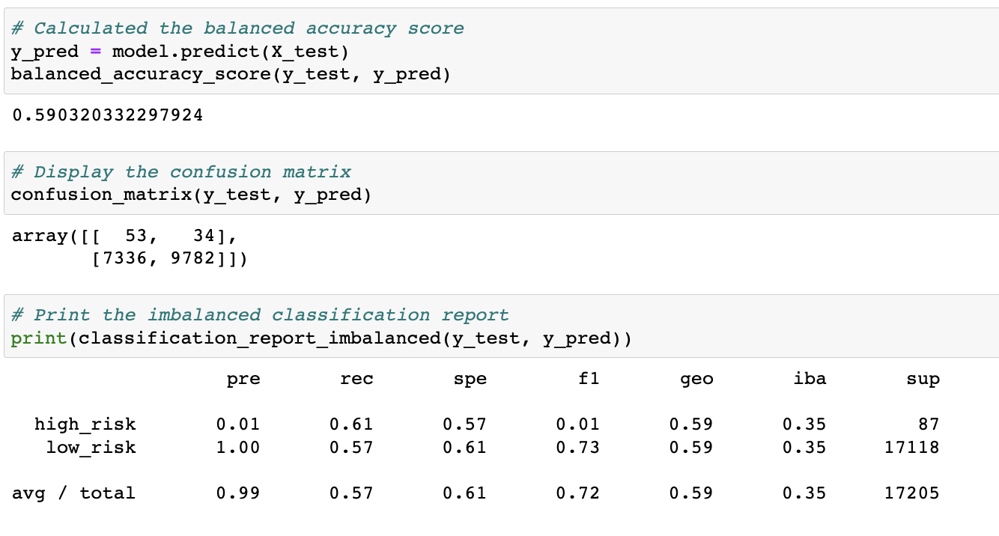
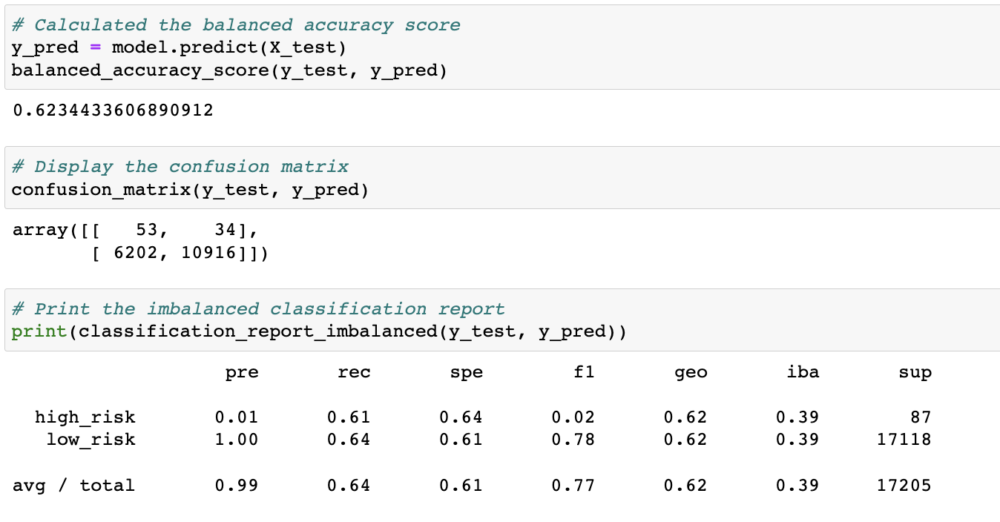
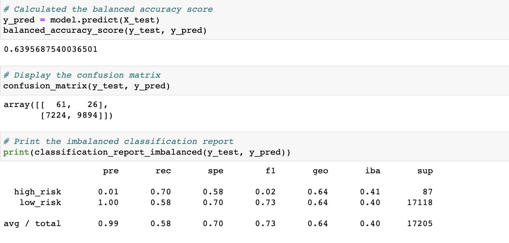
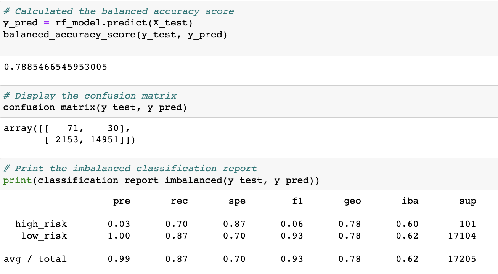
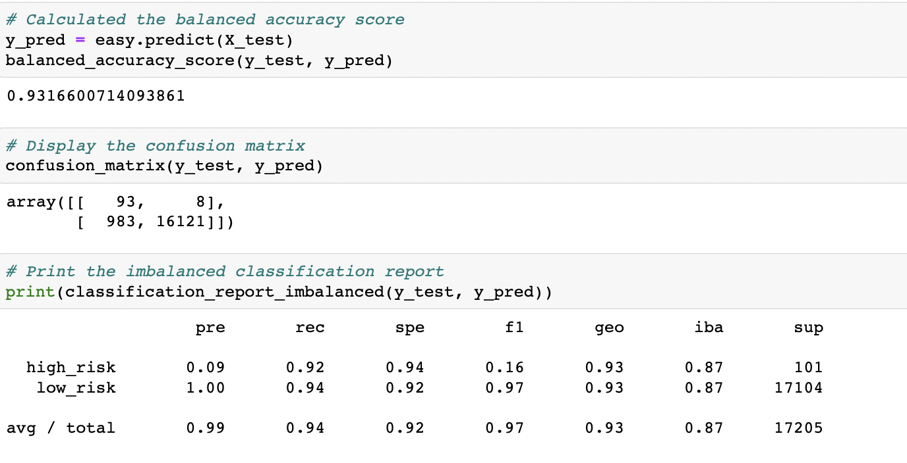

# Credit_Risk_Analysis

## Overview of the analysis

This project aims to predict credit risk for a peer-to-peer lending services company, Lending Club using Supervised machine learning algorithms. The credit card dataset is analyzed using the RandomOverSampler and SMOTE algorithms, and undersampled using the ClusterCentroids algorithm. Finally, we have used combinatorial approach of over- and undersampling using the SMOTEENN algorithm. Then we have compared two new machine learning models that reduce bias, BalancedRandomForestClassifier and EasyEnsembleClassifier, to predict credit risk. Finally, we have evaluated the  performance of these models.

The purpose of this analysis are;
- Use Resampling Models to Predict Credit Risk
- Use the SMOTEENN Algorithm to Predict Credit Risk
- Use Ensemble Classifiers to Predict Credit Risk

Resources:
- Data Source: LoanStats_2019Q1.csv
- Tools: 
        i. NumPy, version 1.11 or later
        ii. SciPy, version 0.17 or later
        iii. Scikit-learn, version 0.21 or later

## Results
The balanced accuracy scores and the precision and recall scores of all six machine learning models.

### Naive Random Oversampling
The balanced accuracy score of this model is 64%. Out of all the loan that the model predicted would be high risk, only 1% were actually high risk. The model predicted 61% outcome correctly for the high risk credit. The precision of the model is 99% with a sensitivity of 68%.

### SMOTE model
 The balanced accuracy score of this model is 59%. The high_risk precision is about 1% only with 61% sensitivity which makes a F1 of 1% only. Due to high number of low_risk population, its precision is 99% with a sensitivity of 57%.
 

### ClusterCentroids model
The balanced accuracy score of this model is 62%. The high_risk precision of this model is about 1% only with 61% sensitivity which makes a F1 of 2% only. The precision is 99% with a sensitivity of 57%.

### SMOTEN model
The balanced accuracy score of this model is 63%. The high_risk precision of this model is about 1% only with 70% sensitivity which makes a F1 of 2% only. The precision is 99% with a sensitivity of 58%.

### BalancedRandomForestClassifier model
The balanced accuracy score of this model has improved to 78%. The high_risk precision of this model is about 1% only with 70% sensitivity which makes a F1 of 6%. The precision is 99% with a sensitivity of 87%.

### EasyEnsembleClassifier model
The balanced accuracy score of this model is 93%. The high_risk precision of this model is about 9%  with 79% sensitivity which makes a F1 of 16%. The precision is 99% with a sensitivity of 94%.

## Summary
All the models that perform the credit risk analysis show weak precision in determining if a credit risk is high. However, the EasyEnsemble Classifier model brought improvement in the sensitivity of the high risk credits by making 92% of the true prediction. F1 score of the model for high risk credit has also improved. 
The EasyEnsembleClassifier model shows a recall of 94% so it detects almost all high risk credit. So, I would recommend EasyEnsemble Classifier model to be used for credit risk analysis.